# Agent Factory

Agent Factory is a guided skillset for building, evaluating, and improving LLM-based agents. It's not a prompt template or an agent framework. It's a disciplined path from product problem to an agent harness with measurable behavior.

Treat an agent as a product with an executable specification. Define the user outcome. Express representative interactions as eval cases. Build the smallest architecture that satisfies them. Use failures as evidence for the next change.

## Quickstart

Clone the repository and open it in Claude Code or Codex:

```bash
git clone <repository-url> agent-factory
cd agent-factory
```

Start the guided setup and lifecycle:

```text
/onboard
```

`/onboard` prepares the local environment, configures the providers you need, and explains the first-build and improvement flows. It then hands off to the lifecycle orchestrator, which routes you through the relevant skills. You don't need to plan the whole process up front.

## The mental model

An LLM solution is a system, not a model call. Its behavior comes from the product objective, instructions and context, model, tools, control flow, and the user conversation working together. Changing any one of these can help one case while breaking another. Evals make those trade-offs visible.

Agent Factory organizes the work into five layers:

1. **Product specification** — identify the user, their job to be done, the agent's boundaries, the value of success, and unacceptable outcomes.
2. **Evaluation design** — turn the specification into realistic conversations and observable criteria. This is the executable product spec.
3. **Agent architecture** — select the context, tools, model roles, state, and control flow required to meet the evals. Prefer the simplest architecture that explains the requirements.
4. **Implementation and baseline** — build the harness, run the suite, and establish what the first version actually does.
5. **Evidence-led iteration** — turn eval failures and selected production traces into diagnoses, bounded changes, regression cases, and held-out validation.

```text
Product goal
    ↓
Representative eval cases
    ↓
Agent harness: prompt + context + tools + control flow
    ↓
Measured baseline
    ↓
Failures and production evidence
    ↓
Diagnosis → repair → held-in and held-out validation
    ↺
```

The repository is opinionated about sequence. Don't optimize prompts before you can state the user outcome and evaluate it. Don't accept a repair until it survives a test beyond the case that motivated it.

## Choosing a solution shape

`/agent-architecture-planner` picks the least autonomous shape that can reliably satisfy your evals, then adds complexity only where evidence shows a simpler shape falls short. There are four shapes to choose from:

- **Model call** — one bounded inference, no tools, no adaptive control flow. Fits a single-use, contained problem, like a one-off extraction of structured data from unstructured text.
- **Workflow** — steps, branches, and stopping conditions are known in advance, with deterministic routing kept in code. Fits a repeatable, predictable process over unstructured data, or one where a stage needs basic model judgment but the overall path never changes.
- **Agent** — the outcome is clear but the path to it isn't. Fits one coherent domain where general capabilities are available and the agent needs to reason about which tool to use, in what order, and how to recover from failure.
- **Multi-agent system** — the problem spans distinct areas of concern that a single agent can't hold at once. Fits larger-scope work where an orchestrator delegates to subagents, each an expert in its own domain, and combines their results.

Each escalation must earn its complexity: it should measurably beat the simpler shape on the same held-in and held-out cases, not just seem more capable in theory.

## Building a first agent

Start at `/onboard`. The first-build flow takes you through:

1. `/agent-goal-interview` — creates a brief with the target users, product problem, business value, scope, risks, and success metrics.
2. `/agent-eval-designer` — designs the eval suite, including simulated users, deterministic checks where possible, qualitative rubrics where necessary, and held-out coverage.
3. `/agent-architecture-planner` — produces an architecture picture and an implementation handoff derived from the goal and evals.
4. `/spec-plan` and `/agent-build-loop`, or your preferred engineering loop — implements the agreed handoff.
5. `/eval-agent` — runs a baseline evaluation against the completed target agent.

The output is more than a working demo. You get a target agent plus an artifact trail explaining what it's meant to do, how it's tested, and which baseline results it achieved.

## Designing test cases and running evals

An eval case represents a user interaction, not an isolated prompt/response. It combines:

- A **simulated user**: motivation, private context, questions, disclosure behavior, and desired outcome.
- A **scenario**: the conditions and conversation the agent must navigate.
- **Evaluators**: outcome checks, trajectory expectations such as tool use, and narrow qualitative rubrics.

The simulated user and target agent converse. The evaluation run captures the conversation and grades the resulting behavior. Use deterministic checks for facts, schemas, tool calls, and other stable properties. Save model-based judges for behavior that genuinely needs qualitative judgment, and keep the rubric narrow.

Cases that expose a known defect become **held-in** regression coverage. Similar cases stay **held-out** so a fix has to generalize instead of overfitting to the example. This distinction is what turns a pile of demos into an evaluation suite.

## Improving an existing agent

Run this when an agent has a failing eval, shows suspicious behavior, or produces a useful production trace:

```text
/agent-lifecycle-orchestrator
```

The improvement flow can start from formal eval artifacts or selected production evidence. It diagnoses failure ownership first: agent behavior, harness/context, tool integration, or the evaluation itself. Then it routes either a direct evidence repair or an engineering handoff. Agent changes are validated against held-in and held-out cases before the learning gets folded back into the suite.

## Core concepts

| Term | Meaning |
|---|---|
| **Target agent** | The LLM-based system being built or improved, including its prompt, context, tools, state, and control flow. |
| **Agent harness** | The code and configuration that invokes the model, assembles context, exposes tools, manages state, and returns behavior to the user. |
| **Eval** | A repeatable experiment that measures whether the target agent satisfies a defined behavior or user outcome. |
| **Simulated user** | A model-driven user with a goal and private context, used to produce realistic multi-turn interactions. |
| **Trajectory** | The sequence of messages, tool calls, state changes, and outcomes produced during an agent interaction. |
| **Held-in case** | A known scenario used for development and regression prevention. |
| **Held-out case** | An unseen scenario reserved to test whether a change generalizes. |
| **Production evidence** | A selected and locally redacted trace used as evidence for diagnosis and improvement. |
| **Baseline** | The measured behavior of a particular agent version before an improvement attempt. |

## What happens during setup

Onboarding creates a local Python environment, installs the repository dependencies, creates `.env` from `.env.example` when needed, installs the repository's commit check, and verifies the Claude Code and Codex adapters.

Model-provider keys are optional individually. Configure only the providers you choose for simulation and judging. Langfuse is also optional; add it when you want remote traces, datasets, experiments, or production evidence. See [evaluation result providers](docs/references/eval-result-providers.md) for the exact options.

## Evaluation infrastructure

Local execution and remote observability are kept separate on purpose:

| Component | Why it is here | Do you need an account? |
|---|---|---|
| LangSmith Python package | Runs local evaluations without uploading results to LangSmith. | No |
| AgentEvals | Scores agent behavior, including expected tool-use sequences. | Only a selected judge model when needed |
| OpenEvals | Provides model-based judges and multi-turn simulated-user conversations. | Only a selected simulator or judge model |
| Langfuse | Optionally stores remote traces, datasets, experiments, and production evidence. | Yes, if you use it |
| pytest | Tests the repository's lifecycle, artifacts, adapters, and evaluation gates. | No |

LangChain and LangGraph may be recommended when they fit the target agent. They are not requirements for the agent you build.

## Useful references

- [Core concepts glossary](docs/references/core-concepts-glossary.md) — a fuller explanation of the terms used by the workflow.
- [Agent-building best practices](docs/references/agent-building-best-practices.md) — the maintained engineering guidance behind architecture and improvement recommendations.
- [Evaluation result providers](docs/references/eval-result-providers.md) — credentials and destinations for evaluation results.

## For people maintaining this repository

The repository works in both Claude Code and Codex. The manuals, skills, and project-agent configuration have shared sources of truth. See [`CLAUDE.md`](CLAUDE.md) before changing them. After changing those shared pieces, run:

```bash
scripts/test-agent-config.sh
```

## Full lifecycle map

Use this diagram when you want to see every stage and handoff. You do not need to memorize it: `/onboard` and `/agent-lifecycle-orchestrator` guide you to the relevant next step.

```mermaid
flowchart TD
    subgraph L["/agent-lifecycle-orchestrator routes stages, validates artifacts, and resumes receipts"]
        direction TB
        subgraph F["First build"]
            direction TB
            ONBOARD["/onboard<br/>repository + credentials"] --> SETUP["lifecycle setup"]
            SETUP --> GOAL["/agent-goal-interview<br/>brief + commercial value model"]
            GOAL --> DESIGN["/agent-eval-designer<br/>cases + rubrics + simulated user"]
            DESIGN --> ARCH["/agent-architecture-planner<br/>architecture picture + build handoff"]
            ARCH --> BUILD{"Selected engineering loop"}
            BUILD --> MINI["/spec-plan → /agent-build-loop<br/>TDD plan + optional testagent probes"]
            BUILD --> EXTERNAL["External coding agent<br/>or preferred engineering loop"]
            MINI --> RECEIPT["Engineering receipt"]
            EXTERNAL --> RECEIPT
            RECEIPT --> RECONCILE["/agent-architecture-planner<br/>reconcile picture if architecture changed"]
            RECONCILE --> BASELINE["/eval-agent<br/>simulated user ↔ target agent<br/>baseline evaluation"]
            BASELINE --> OPERATIONAL["Agent baseline<br/>prompt, toolset"]
        end

        subgraph I["Continuous improvement"]
            direction TB
            IMPROVESTART{"Start from"}
            IMPROVESTART --> EVALRUN["/eval-agent<br/>run formal test cases"]
            IMPROVESTART --> PROD["/agent-production-evidence<br/>select production trace"]
            EVALRUN --> CONVERSATION["Simulated user ↔ target agent<br/>conversation + trajectory"]
            CONVERSATION --> EVIDENCE["Eval artifacts or promoted trace"]
            PROD --> EVIDENCE
            EVIDENCE --> REVIEW["/agent-behavior-review<br/>diagnose behavior and ownership"]
            REVIEW -.-> PROBE["testagent + conversation runner<br/>exploratory boundary probes"]
            PROBE -.-> REVIEW
            REVIEW --> IMPROVE["/agent-self-improvement<br/>generate learnings + bounded fixes"]
            IMPROVE -->|"eval, harness, or evidence repair"| EVALFIX["Apply eval/evidence fix"]
            EVALFIX --> EVALRUN
            IMPROVE -->|"agent harness or context change"| CHANGE["Improvement handoff"]
            CHANGE --> CHANGELOOP{"Selected engineering loop"}
            CHANGELOOP --> CHANGEBUILD["/spec-plan → /agent-build-loop<br/>or external loop"]
            CHANGEBUILD --> CHANGERECEIPT["Engineering receipt"]
            CHANGERECEIPT --> CHANGESYNC["/agent-architecture-planner<br/>reconcile if required"]
            CHANGESYNC --> HELDIN["/eval-agent<br/>held-in validation"]
            HELDIN --> HELDOUT["/eval-agent<br/>held-out validation"]
            HELDOUT --> LEARN["/eval-compound-learnings<br/>improve the eval loop"]
            LEARN --> AGAIN{"Run test cases again?"}
            AGAIN -->|"yes"| EVALRUN
            AGAIN -->|"no"| END(["End"])
        end

        OPERATIONAL ~~~ IMPROVESTART
    end
```


