# Self-Improving Agent Template

A CLI-first, skills-based repository for defining, evaluating, building, and continuously improving an agent harness and its context. It includes a small engineering loop, but that loop can be replaced by another engineering process or a standard coding agent.

## Clone setup

```bash
git clone <repository-url> self-improving-agent-template
cd self-improving-agent-template
direnv allow
scripts/agent-setup
```

`direnv allow` adds the repository `bin/` directory to the local command path, including the exact `testagent` command. Setup creates `.venv`, installs `requirements.txt`, copies `.env.example` to `.env` only when `.env` is absent, installs the repository pre-commit gate, and validates Claude/Codex adapters. Add one model-provider key for each selected simulator or judge directly to `.env`. Add LangSmith or Langfuse credentials only when selecting that evidence destination. Never put credentials in chat.

Eval result destinations and their optional credential setup are documented in [docs/references/eval-result-providers.md](docs/references/eval-result-providers.md).

## Repository shape

```text
self-improving-agent-template/
├── README.md
├── CLAUDE.md
├── AGENTS.md -> CLAUDE.md
├── .env.example
├── requirements.txt
├── bin/
├── .claude/
│   ├── skills/
│   │   ├── agent-lifecycle-orchestrator/
│   │   ├── agent-goal-interview/
│   │   ├── agent-eval-designer/
│   │   ├── agent-architecture-planner/
│   │   ├── spec-plan/
│   │   ├── agent-build-loop/
│   │   ├── human-verify/
│   │   ├── eval-agent/
│   │   ├── agent-behavior-review/
│   │   ├── agent-production-evidence/
│   │   ├── agent-self-improvement/
│   │   └── eval-compound-learnings/
│   └── agents/
│       ├── testagent-conversation-runner.md
│       ├── live-transcript-reviewer.md
│       ├── finding-fragment-writer.md
│       └── final-spec-compiler.md
├── .agents/skills -> ../.claude/skills
├── .codex/agents/
│   ├── testagent-conversation-runner.toml
│   ├── live-transcript-reviewer.toml
│   ├── finding-fragment-writer.toml
│   └── final-spec-compiler.toml
├── .githooks/pre-commit
├── docs/references/
├── scripts/
├── src/agent_creation/
├── tests/
└── agent-lifecycle/
    ├── setup.yaml
    ├── state.yaml
    ├── agent-definition/
    ├── architecture/
    ├── evals/
    ├── evidence/
    ├── handoffs/
    ├── receipts/
    └── attempts/
```

## Lifecycle

```mermaid
flowchart TD
    subgraph L["/agent-lifecycle-orchestrator routes stages, validates artifacts, and resumes receipts"]
        direction TB
        subgraph F["First build"]
            direction TB
            SETUP["setup"] --> GOAL["/agent-goal-interview<br/>brief + commercial value model"]
            GOAL --> DESIGN["/agent-eval-designer<br/>cases + rubrics + simulated user"]
            DESIGN --> ARCH["/agent-architecture-planner<br/>architecture picture + build handoff"]
            ARCH --> BUILD{"Selected engineering loop"}
            BUILD --> MINI["/spec-plan → /agent-build-loop<br/>TDD plan + optional testagent probes"]
            BUILD --> EXTERNAL["External coding agent<br/>or preferred engineering loop"]
            MINI --> RECEIPT["Engineering receipt"]
            EXTERNAL --> RECEIPT
            RECEIPT --> RECONCILE["/agent-architecture-planner<br/>reconcile picture if architecture changed"]
            RECONCILE --> BASELINE["/eval-agent<br/>baseline evaluation"]
            BASELINE --> OPERATIONAL["Agent baseline<br/>prompt, toolset"]
        end

        subgraph I["Continuous improvement"]
            direction TB
            IMPROVESTART{"Start from"}
            IMPROVESTART --> EVALRUN["/eval-agent<br/>run test suite with user agent"]
            IMPROVESTART --> PROD["/agent-production-evidence<br/>select production trace"]
            EVALRUN --> EVIDENCE["Eval artifacts or promoted trace"]
            PROD --> EVIDENCE
            EVIDENCE --> REVIEW["/agent-behavior-review<br/>diagnose with optional testagent probes"]
            REVIEW --> IMPROVE["/agent-self-improvement<br/>generate learnings + bounded fixes"]
            IMPROVE -->|"eval, harness, or evidence repair"| EVALFIX["Apply eval/evidence fix"]
            EVALFIX --> FIXRERUN["/eval-agent<br/>rerun repaired test cases with user agent"]
            FIXRERUN --> FIXRETURN(["Return to eval artifacts<br/>and diagnosis"])
            IMPROVE -->|"agent harness or context change"| CHANGE["Improvement handoff"]
            CHANGE --> CHANGELOOP{"Selected engineering loop"}
            CHANGELOOP --> CHANGEBUILD["/spec-plan → /agent-build-loop<br/>or external loop"]
            CHANGEBUILD --> CHANGERECEIPT["Engineering receipt"]
            CHANGERECEIPT --> CHANGESYNC["/agent-architecture-planner<br/>reconcile if required"]
            CHANGESYNC --> HELDIN["/eval-agent<br/>held-in validation"]
            HELDIN --> HELDOUT["/eval-agent<br/>held-out validation"]
            HELDOUT --> LEARN["/eval-compound-learnings<br/>improve the eval loop"]
            LEARN --> AGAIN{"Run test cases again?"}
            AGAIN -->|"yes"| RERUN["/eval-agent<br/>run test suite with user agent"]
            RERUN --> REPEAT(["Repeat from Start"])
            AGAIN -->|"no"| END(["End"])
        end

        OPERATIONAL ~~~ IMPROVESTART
    end
```



## Harness checks

```bash
scripts/agent-config/sync_agent.py --from claude live-transcript-reviewer
scripts/agent-config/verify_agent_config.py
scripts/test-agent-config.sh
```

The staged pre-commit gate runs only when harness files are staged and rejects broken links, malformed skills, missing role pairs, or stale role renderings.
