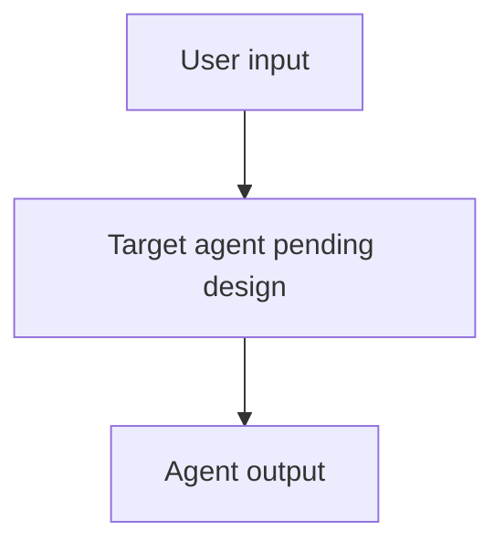

# Target Agent Architecture

Status: pending

Architecture: pending

## Visual Source of Truth

Complete the goal, value, eval, and architecture-planning stages before treating this diagram as a runtime decision.
